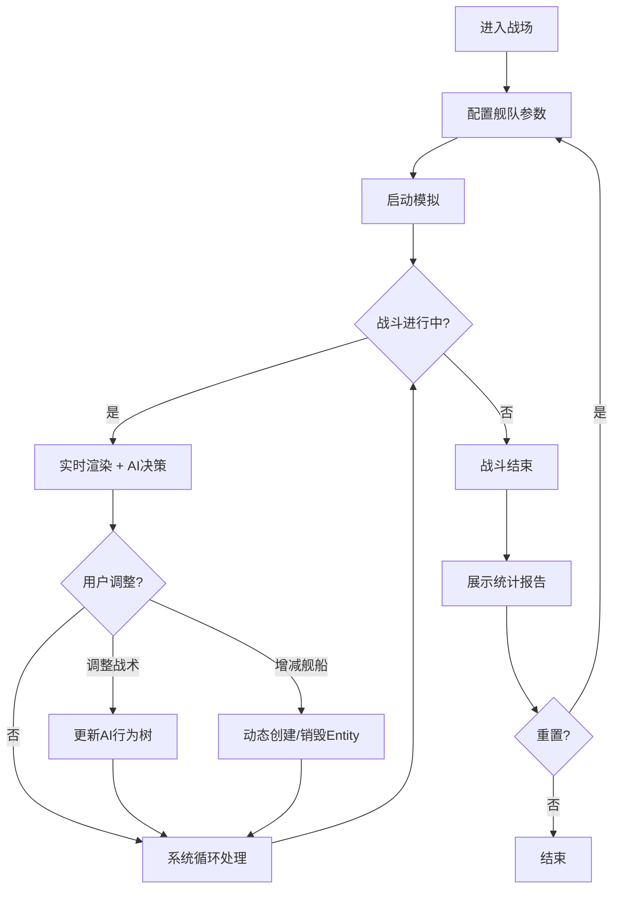

## 1. 产品概述

2D舰队对战模拟器——基于ECS（Entity-Component-System）架构的实时海战推演平台，支持AI驱动的自动交战、中途战术调整与实时战斗统计。目标用户为策略游戏爱好者、游戏开发者及算法研究人员。

## 2. 核心功能

### 2.1 功能模块

1. **战斗模拟页**：Canvas实时渲染战场、舰队操控面板、战术参数调节
2. **战斗统计面板**：DPS、存活率、击杀数等实时与战后数据

### 2.2 页面详情

| 页面名称 | 模块名称 | 功能描述 |
|---------|---------|---------|
| 战斗模拟页 | 战场画布 | Canvas 2D实时渲染两方舰队、弹道、爆炸特效、网格背景 |
| 战斗模拟页 | 舰队操控面板 | 调整某方舰队数量（增减舰船）、切换战术（集中火力/分散游击） |
| 战斗模拟页 | 模拟控制栏 | 开始/暂停/重置/倍速控制 |
| 战斗模拟页 | 舰船信息浮窗 | 鼠标悬停显示单舰血量、武器冷却、当前AI状态 |
| 战斗统计页 | 实时统计面板 | 双方DPS、存活率、总伤害、击杀数实时更新 |
| 战斗统计页 | 战后报告 | 战斗结束后展示详细数据图表与胜负判定 |
| 战斗统计页 | 时间线回放 | 战斗关键事件时间轴 |

## 3. 核心流程

用户进入战场 → 配置双方舰队参数（数量、战术） → 启动模拟 → 实时观战（可中途调整战术/增减舰船） → 战斗结束查看统计报告 → 可重置再来

## 4. 用户界面设计

### 4.1 设计风格

- **主色调**：深海蓝黑(#0a0e1a) + 雷达绿(#00ff88) + 警告红(#ff3366)
- **次色调**：暗青(#1a2a3a)、冰蓝(#4488ff)、琥珀黄(#ffaa00)
- **字体**：Rajdhani（显示字体，军事科技感）+ Source Code Pro（数据字体）
- **布局**：左侧主战场Canvas + 右侧控制/统计面板
- **风格**：军事指挥中心/雷达站美学，网格线、扫描线效果、全息感数据面板
- **动效**：舰船尾迹、弹道拖尾、爆炸粒子、扫描线动画、数据面板脉冲

### 4.2 页面设计概览

| 页面名称 | 模块名称 | UI元素 |
|---------|---------|---------|
| 战斗模拟页 | 战场画布 | 深色网格背景、圆形舰船（蓝方/红方）、弹道光束、爆炸粒子、小地图 |
| 战斗模拟页 | 舰队操控面板 | 红蓝双方面板、舰船数量滑块、战术切换按钮（集中火力/分散游击）、增援/撤退按钮 |
| 战斗模拟页 | 模拟控制栏 | 底部控制栏：播放/暂停、重置、1x/2x/4x倍速 |
| 战斗统计页 | 实时统计面板 | 双栏对比：HP条、DPS折线、存活率环形图、击杀计数器 |
| 战斗统计页 | 战后报告 | 胜负横幅、详细数据表、伤害分布图 |

### 4.3 响应式设计

桌面端优先，战场画布自适应窗口大小，控制面板在窄屏时可折叠为底部抽屉。
