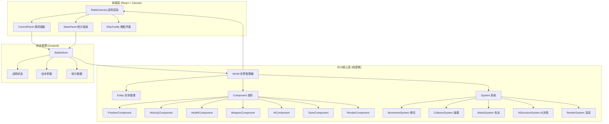
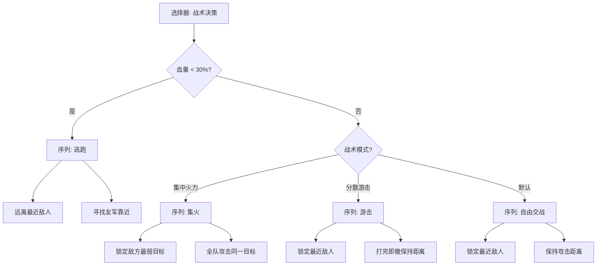
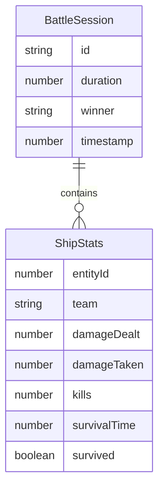

## 1. 架构设计



## 2. 技术说明

- **前端**：React@18 + TypeScript + TailwindCSS@3 + Vite
- **初始化工具**：vite-init
- **后端**：无（纯前端本地运行，ECS核心逻辑在前端执行）
- **数据库**：无（内存模拟，战斗数据实时计算）
- **状态管理**：Zustand
- **渲染引擎**：HTML5 Canvas 2D API（自定义渲染循环）

## 3. 路由定义

| 路由 | 用途 |
|------|------|
| `/` | 主战场页面（Canvas + 控制面板 + 统计面板一体化布局） |

## 4. ECS架构详细设计

### 4.1 Entity（实体）

实体仅为数字ID，不包含任何逻辑或数据。

### 4.2 Component（组件）

| 组件名 | 字段 | 说明 |
|--------|------|------|
| PositionComponent | x, y, angle | 位置与朝向 |
| VelocityComponent | vx, vy, maxSpeed | 速度与最大速度 |
| HealthComponent | hp, maxHp, alive | 血量与存活状态 |
| WeaponComponent | cooldown, maxCooldown, damage, range | 武器冷却、伤害、射程 |
| AIComponent | behaviorTree, targetId, state | AI行为树、目标、当前状态 |
| TeamComponent | team (red/blue) | 所属阵营 |
| RenderComponent | size, color, trail | 渲染尺寸、颜色、尾迹点 |

### 4.3 System（系统）

| 系统名 | 职责 | 处理流程 |
|--------|------|---------|
| MovementSystem | 根据速度更新位置 | 遍历所有含Position+Velocity的实体，更新坐标，限制边界 |
| CollisionSystem | 检测舰船/弹道碰撞 | 空间哈希加速碰撞检测，触发伤害事件 |
| AttackSystem | 处理武器发射与伤害 | 检查冷却→寻找目标→发射弹道→命中扣血 |
| AIDecisionSystem | 行为树决策 | 评估态势→选择行为（追击/逃跑/集火/游击）→设定目标 |
| RenderSystem | Canvas绘制 | 绘制网格、舰船、弹道、爆炸特效、UI元素 |

### 4.4 AI行为树



## 5. 数据模型

### 5.1 战斗统计模型



## 6. 项目目录结构

```
src/
├── ecs/
│   ├── World.ts              # 世界管理器
│   ├── Entity.ts             # 实体管理
│   ├── Component.ts          # 组件定义
│   ├── System.ts             # 系统基类
│   ├── components/
│   │   ├── PositionComponent.ts
│   │   ├── VelocityComponent.ts
│   │   ├── HealthComponent.ts
│   │   ├── WeaponComponent.ts
│   │   ├── AIComponent.ts
│   │   ├── TeamComponent.ts
│   │   └── RenderComponent.ts
│   └── systems/
│       ├── MovementSystem.ts
│       ├── CollisionSystem.ts
│       ├── AttackSystem.ts
│       ├── AIDecisionSystem.ts
│       └── RenderSystem.ts
├── ai/
│   ├── BehaviorTree.ts       # 行为树框架
│   ├── nodes/
│   │   ├── SelectorNode.ts
│   │   ├── SequenceNode.ts
│   │   └── ConditionNode.ts
│   └── tactics/
│       ├── FocusFireTactic.ts
│       └── GuerrillaTactic.ts
├── store/
│   └── battleStore.ts        # Zustand状态管理
├── components/
│   ├── BattleCanvas.tsx      # Canvas渲染组件
│   ├── ControlPanel.tsx      # 操控面板
│   ├── StatsPanel.tsx        # 统计面板
│   ├── ShipTooltip.tsx       # 舰船浮窗
│   └── SimControls.tsx       # 模拟控制栏
├── pages/
│   └── BattlePage.tsx        # 主战场页面
├── utils/
│   ├── math.ts               # 数学工具
│   └── spatialHash.ts        # 空间哈希
└── App.tsx
```
